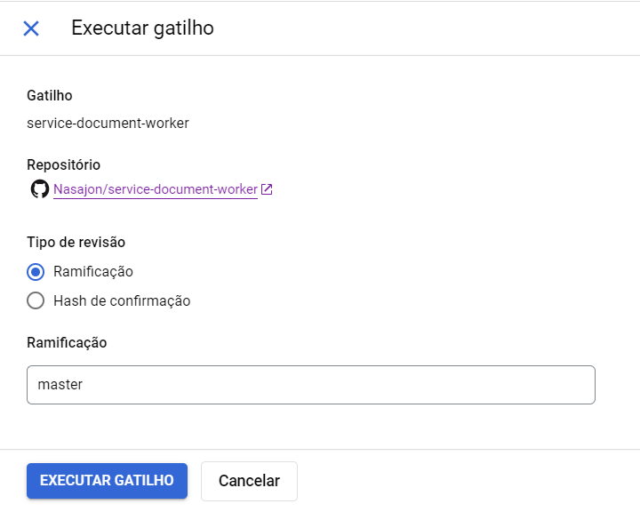
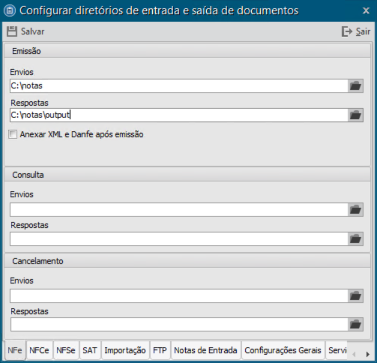
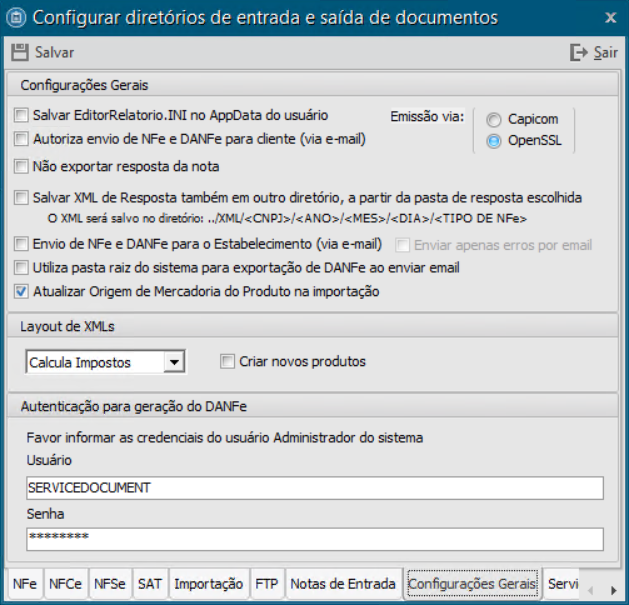
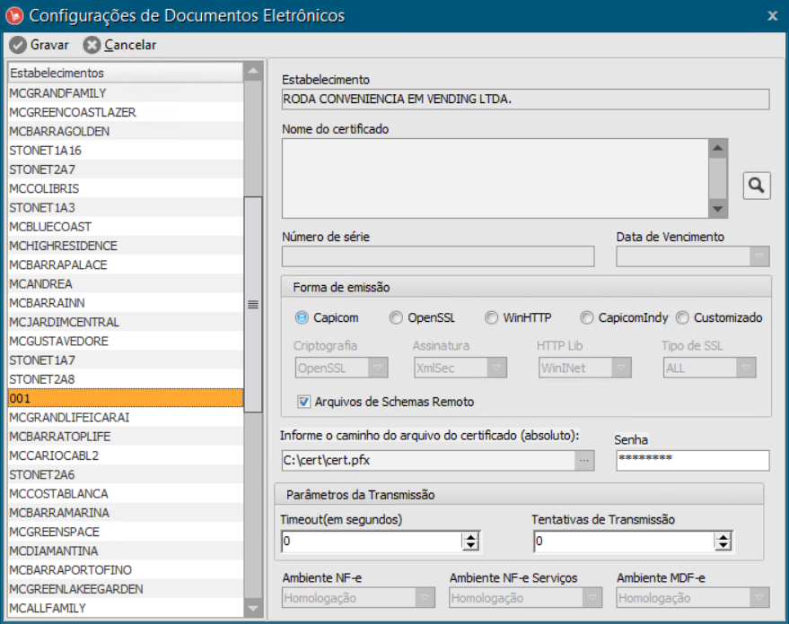

# Service Document Worker
## Objetivo do projeto
Empacotamento e distribuição (via Docker) de um worker de emissão de notas (ServiceDocument + JobPython)
O objetivo do projeto é prover uma infraestrutura de emissão de notas, utilizando um worker para processar as entradas no banco vindas de uma API, afim de transforma-las em um XML válido aceito pelo Service Document, que é usado para, enfim, gerar a nota.
O projeto possui o código fonte do worker, escrito em Python, que é feito para ser executado em dado intervalo de tempo, e também possui o código fonte para uma API Flask, que é usada no processo de [Build Automático](#build-automático) que será explicado posteriormente.

## Ambiente de desenvolvimento
Nesta seção haverá uma breve descrição da estrutura do projeto e como subir o projeto localmente para desenvolvimento.
### Estrutura do projeto
#### [api-src/](api-src)
Pasta onde fica o código fonte da API utilizada para a build e empacotamento do executável do Service Document e do Worker.
#### [src/](src)
Pasta onde fica o código fonte do Worker.
#### cloudbuild.yaml
Arquivo onde fica a configuração de build utilizada pelo Cloud Build.
#### Dockerfile
Arquivo utilizado para montar imagem docker
#### entrypoint,py
Arquivo utilizado como entrypoint da imagem Docker gerada. Serve para executar o worker de tempos em tempos.

### Como rodar o projeto
1. Clone o projeto:

> git clone git@github.com:Nasajon/service-document-worker.git

2. Crie uma cópia local do arquivo `.env.dist`, renomeando a mesma para `.env`.
3. Ajuste as variáveis de ambiente sem conteúdo no arquivo `.env`.
4. Crie um ambiente virtual python3:
> python3 -m venv .venv
5. Inicie o ambiente virtual.
> ./.venv/source/bin/activate
6. Instale as dependências do projeto.
> pip install -r requirements.txt
7. Execute o worker com o seguinte comando:
> python -m nsj_jobs.emissao_nota 

## Build automático
O Build Automatico é feito utilizando [um gatilho no Cloud Build](https://console.cloud.google.com/cloud-build/builds;region=global?query=trigger_id%3D%2237b71483-4790-4024-9fae-171d1558dc09%22&project=arquitetura-338221). 

### Como disparar a build
A build é feita de forma automática para o ramo **master** e todos aqueles que começarem com **v2.**, toda vez que há um novo commit neles. 

Também é possível disparar a build manualmente, [na tela de gatilhos do Cloud Build](https://console.cloud.google.com/cloud-build/triggers?project=arquitetura-338221). Basta clicar em "EXIBIR" no gatilho nomeado "service-document-worker" e a seguinte tela irá aparecer:



É necessário, então, selecionar o ramo que queira buildar, clicar em "EXECUTAR GATILHO" e aguardar o fim do processo.

### Processo de build
O processo de build é realizado utilizando [uma VM no Compute Engine](https://console.cloud.google.com/compute/instancesDetail/zones/us-central1-a/instances/worker-nfe?project=arquitetura-338221). 

O processo ocorre em 3 etapas principais, descritas abaixo.
#### Etapa 1: Inicialização da VM
É feita a inicialização da VM em que o processo de build é realizado. A VM possui algumas pecualiaridades, que serão descritas neste documento. 

Ao iniciar a VM uma tarefa agendada é executada, nela é executado um comando para levantar a API usada para o processo de build.

#### Etapa 2: Chamada a API para iniciar processo de build
É feita uma chamada a API para iniciar o processo de build, passando como parâmetro o ramo que ativou o gatilho. 

No processo de build, ocorrem os seguintes passos:
1. É executado um código para programar o desligamento do Windows. Essa medida foi necessária por uma limitação técnica, para que, em caso de erro na build, a VM não fique ligada desnecessariamente, o que geraria custos desnecessários. A VM é desligada em 30 minutos em caso de erro. Imediatamente antes, é executado um código para cancelar qualquer timer de desligamento que esteja ativo, para garantir que o processo de build terá 30 minutos para ser finalizado.
2. Baseado no parâmetro recebido na API, o nome do ramo que será usada para gerar a versão, são executados comandos git de `checkout` e `pull` para o ramo especificado. Também é baixado o ramo equivalente do repositório do instalador, pois arquivos do mesmo são empacotados juntos com o executável do Service Document.
3. Com base na versão do ramo, é baixada a versão equivalente do Service Document, diretamente do Nexus.
4. É feito de fato o início da build da imagem Docker que empacota o worker e o executável do Service Document junto com suas dependências. É uma imagem Windows, que usa os contêiners do Windows do Docker. Por limitações da própria ferramenta, o servidor usado para a build da imagem e o servidor utilizado para levantar a imagem Docker em produção devem ter a mesma versão do Windows. A versão do Windows que utilizamos atualmente é o Windows Server 2019. Após a build, é feita o upload da imagem para uso posterior.
5. Por fim, é feita a limpeza de arquivos temporários criados durante a build.

Todo esse processo de build pode ser verificado com mais detalhes no arquivo [build_service.py](api-src/app/service/build_service.py).

#### Etapa 3: Desligamento da VM
Por fim, é realizado o desligamento da VM; ela só fica ligada enquanto o processo de build está acontecendo.

### Consultar versão gerada
Para consultar a versão gerada no processo de build, basta acessar o [histórico de versões do gatilho no Cloud Build](https://console.cloud.google.com/cloud-build/builds;region=global?query=trigger_id%3D%2237b71483-4790-4024-9fae-171d1558dc09%22&project=arquitetura-338221), escolher a versão desejada (de acordo com a coluna `ref`, que diz o nome do ramo que deu origem a versão). Ao acessar um dos itens da lista, basta ir na etapa `Call API Builder`, que haverá um JSON num formato semelhante ao seguinte:
```json
{
    "image_name": "arquiteturansj/servicedocumentworker:v2.2203-8181", 
    "service_document_version": "2.2203.44.0"
}
```

A propriedade `image_name` consiste no nome e tag da imagem docker gerada, enquanto a propriedade `service_document_version` consiste na versão do Service Document que foi empacotada na imagem.


## Deploy em produção
Existem uma série de configurações necessárias para o correto funcionamento do worker e service document em ambiente de produção.

### Configurações gerais no AdminSQL
Com o AdminSQL aberto, na aba `Serviços de Emissão`, selecionar a opção `Configurar Diretórios` e uma tela será aberta. Nela, existem várias abas que possuem configurações necessárias para o funcionamento do projeto e serão descritas a seguir.

#### Configurar diretórios
A priori nas abas `NFe`, `NFCe` e `NFSe`, deve-se configurar, em `emissão` o diretório de `Envios` como `C:\notas` e o de `Respostas` como `C:\notas\output`.



Esses dois caminhos são uma convenção do projeto, criadas durante a build do projeto. Esses caminhos existem dentro do contêiner que empacota o worker e o Service Document e será lá que os XMLs do Service Document e as respostas serão guardadas.

#### Configurações Gerais
Na aba `Configurações Gerais` deve-se configurar o `Layout de XMLs` com a opção `Calcula Impostos` e o `Usuário` e `Senha` com as credenciais que devem ser usadas. Tal como na imagem a seguir:



É altamente recomendado que seja criado um usuário próprio para o Service Document + Worker, pois será necessário definir configurações por usuário na seção a seguir (`Configurações no EstoqueSQL`) e recomenda-se que se use o mesmo usuário aqui. 

### Configurações no EstoqueSQL
Na aba `Sistema`, separador `Configurações` e item `Configurações`, selecionar a opção `Documentos Eletrônicos` no menu suspenso. Na tela que se abre serão feitas configurações para a geração de notas nos respectivos estabelecimentos para o usuário atualmente logado.

#### Configurações por estabelecimento
Na tela, deve-se escolher o estabelecimento emissor da nota e configurar individualmente para cada estabelecimento.

Em `Forma de emissão` deve-se manter a opção `Capicom` selecionada.

Mais abaixo, deve-se informar o caminho do arquivo do certificado e a senha do certificado. Por convenção, utilizamos arquivo do certificado no caminho `C:\cert\cert.pfx`. Isso é importante pois esse mesmo caminho deve ser usado na criação do volume do contêiner Docker posteriormente, na seção `Deploy do contêiner em produção`.

Vide imagem a seguir: 



**ATENÇÃO**: **É importante notar que, para testes, as opções `Ambiente NF-e`, `Ambiente NF-e Serviços` e `Ambiente MDF-e` devem estar como `Homologação`, enquanto para emissão em ambiente de produção a opção selecionada deve ser `Produção`. É importante garantir que a opção correta está selecionada nestes itens.**

### Deploy do contêiner em produção
Atualmente realizamos o deploy manualmente em uma máquina Windows. 

É necessário que a máquina tenha `Docker for Windows` instalado e que use os `Contêiners do Windows`.

É necessário também ter em mãos os valores das variáveis de ambientes utilizadas pelo contêiner, descritas a seguir.

#### Variáveis de ambiente
|Nome da Variável| Descrição | Valor padrão
|-|-|-|
|database_host|Host onde o banco de dados do ERP está localizado|localhost|
|database_name|Nome do banco de dados do ERP que deve ser acessado|integratto2|
|database_user|Usuário do banco de dados|postgres|
|database_password|Senha do usuário do banco de dados|postgres|
|database_port|Porta do banco de dados|5432|
|erp_user|Usuário do ERP que deverá ser usado pelo Service Document|MASTER|
|erp_password|Senha **CRIPTOGRAFADA** do usuário|N/A|
|maximo_tentativas|Ao falhar uma tentativa de emissão, será o número de vezes que o worker tentará emitir novamente.|24|
|frequencia_job|Intervalo de execução do Worker em segundos|300|

#### Deploy do contêiner
Dentro da máquina Windows disponibilizada, deve-se baixar a imagem desejada (vide seção: `Build Automático`). Depois, basta executar o comando `docker run`. Deve-se usar a flag `-e` para definir as variáveis de ambiente as quais não se deseja usar o valor padrão e criar um volume com a flag `-v` contendo o certificado para emissão da nota. Conforme exemplo a seguir:

> TODO: exemplo

Para mais informações: [Docker run reference](https://docs.docker.com/engine/reference/run/)

#### Como executar Service Document e Worker manualmente dentro do contêiner
TODO
